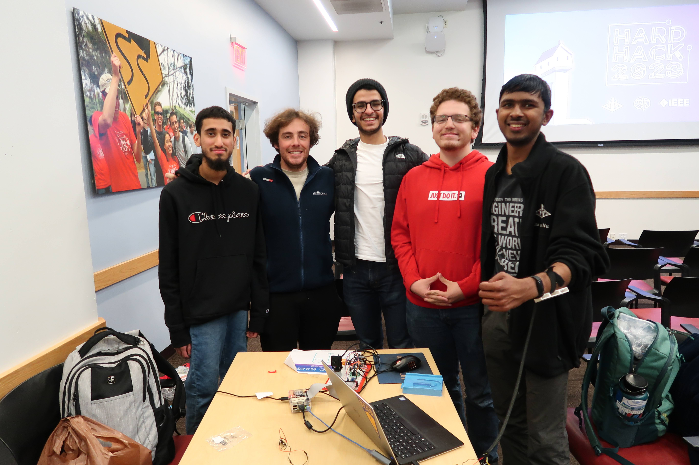
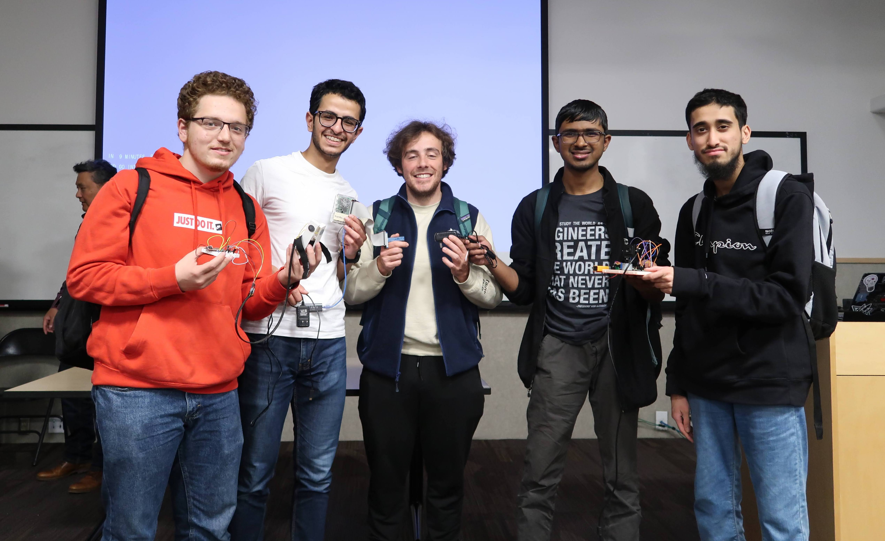

# ProstheTech UCSD

<b>HARD Hack Runner-Up<b>

## Inspiration
One of the obstacles faced by some people with disabilities and amputees is the inaccessibility of devices used to produce creative media such as cameras- and the market solutions that do exist are often extremely expensive. The goal of our project is to create a low cost prosthetic device that can be controlled with an EMG that can record arm flex movements. 

## What it does
Our prosthetic device can be used to remote remotely control the orientation of a camera by the user activating their muscles. 
* Our device consists of a 3D printed EMG that can be attached to the user's arm with an adjustable adhesive strap. The pins of the EMG are connected to an ESP32 microntroller. The EMG allows the device to detect when the user flexes their arm and when is released.
* The ESP32 wirelessly transmits via the EMG data to the prosthetic camera device, which is controlled by a Raspberry Pi. The position of the camera changes in response to a change in the input signal.
* The Raspberry Pi also is connected to a web server that can display the EMG data on a plot in real time, as well as the camera feed.

## How we built it
The main input signal that drives our device is the voltage difference between two electrodes of the EMG. We amplified the signal using an op-amp circuit we designed consisting of an instrumentation op-amp. The ESP32 was programmed in Arduino C, while the Raspberry Pi was programmed in Python. We plotted the EMG data on the website using the ChartJS library. The ESP32 communicates with the Raspberry Pi via Bluetooth.

## Challenges we ran into
By far, we ran into the most challenges when designing the circuit that would amplify the EMG signals that would be transmitted to the ESP32. As it turns out, most of the issues we faced arose from us using the incorrect op-amp in our amplifier circuit. At first, we tried implementing a low pass analog RC filter to filter our EMG signals by attenuating signals of higher frequency, but we determined that digitally filtering our data using Python would be more reliable and less prone to disturbances.

## Accomplishments that we're proud of
We were successful in actually implementing a working EMG using low cost parts and our knowledge of circuit theory, even though we thought it seemed unlikely to complete successfully at the start of our efforts.

## What we learned
Use the parts that are given to you and don't try to overthink things. Joking aside, this project was a great learning experience for us in part because it required us to utilize our knowledge in both digital and analog electronics. We all needed to have a grasp of analog signal amplification, analog-to-digital conversion, and networking with a web server to refine each part of our design.

## What's next for ProstheTech UCSD
One of the longer term goals of our project is to implement more advanced DSP methods to better filter the EMG signals and make our prosthetic device less prone to external noise. We also would like to create an actual low cost prosthetic/robotic arm that is specifically geared towards media production.

## Team Photos

